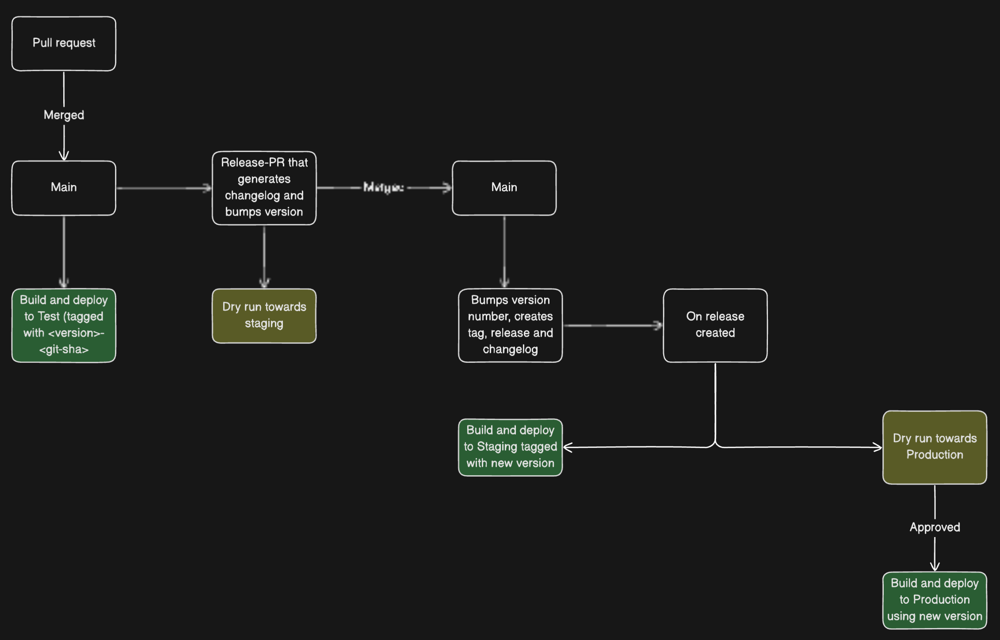

# Dialogporten

## Getting started with local development

### Mac 

#### Prerequisites

- [.NET 8 SDK](https://dotnet.microsoft.com/en-us/download/dotnet/8.0) (see [global.json](global.json) for the currently required version)

#### Installing Podman (Mac)

1. Install [Podman](https://podman.io/)

2. Install dependencies:
```bash
brew tap cfergeau/crc
# https://github.com/containers/podman/issues/21064
brew install vfkit
brew install docker-compose
```

3. Restart your Mac

4. Finish setup in Podman Desktop

5. Check that `Docker Compatility mode` is enabled, see bottom left corner

6. Enable privileged [testcontainers-dotnet](https://github.com/testcontainers/testcontainers-dotnet/issues/876#issuecomment-1930397928)  
`echo "ryuk.container.privileged = true" >> $HOME/.testcontainers.properties`

### Windows 

#### Prerequisites

- [Git](https://git-scm.com/download/win)
- [.NET 8 SDK](https://dotnet.microsoft.com/en-us/download/dotnet/8.0)
- [WSL2](https://docs.microsoft.com/en-us/windows/wsl/install) (To install, open a PowerShell admin window and run `wsl --install`)
- [Virtual Machine Platform](https://support.microsoft.com/en-us/windows/enable-virtualization-on-windows-11-pcs-c5578302-6e43-4b4b-a449-8ced115f58e1) (Installs with WSL2, see link above)

#### Installing Podman (Windows)

1. Install [Podman Desktop](https://podman.io/getting-started/installation).
. 
2. Start Podman Desktop and follow instructions to install Podman.

3. Follow instructions in Podman Desktop to create and start a Podman machine.

4. In Podman Desktop, go to Settings -> Resources and run setup for the Compose Extension. This will install docker-compose.

### Running the project

You can run the entire project locally using `podman compose`. (This uses docker-compose behind the scenes.)
```powershell
podman compose up
```

The following GUI services should now be available:
* WebAPI/SwaggerUI: [localhost:7124/swagger](https://localhost:7214/swagger/index.html)
* GraphQl/BananaCakePop: [localhost:7215/graphql](https://localhost:7214/swagger/index.html)
* Redis/Insight: [localhost:7216](https://localhost:7214/swagger/index.html)

The WebAPI and GraphQl services are behind a nginx proxy, and you can change the number of replicas by setting the `scale` property in the `docker-compose.yml` file.


### Running the WebApi/GraphQl in an IDE
If you need do debug the WebApi/GraphQl projects in an IDE, you can alternatively run `podman compose` without the WebAPI/GraphQl.  
First create a dotnet user secret for the DB connection string.

```powershell
dotnet user-secrets set -p .\src\Digdir.Domain.Dialogporten.WebApi\ "Infrastructure:DialogDbConnectionString" "Server=localhost;Port=5432;Database=Dialogporten;User ID=postgres;Password=supersecret;"
```

Then run `podman compose` without the WebAPI/GraphQl projects.
```powershell
podman compose -f docker-compose-no-webapi.yml up 
```

## DB development
This project uses Entity Framework core to manage DB migrations. DB development can ether be done through Visual Studios Package Manager Console (PMC), or through the CLI. 

### DB development through PMC
Set Digdir.Domain.Dialogporten.Infrastructure as startup project in Visual Studios solution explorer, and as default project in PMC. You are now ready to use [EF core tools through PMC](https://learn.microsoft.com/en-us/ef/core/cli/powershell). Run the following command for more information:
```powershell
Get-Help about_EntityFrameworkCore
```

### DB development through CLI
Install the CLI tool with the following command:
```powershell
dotnet tool install --global dotnet-ef
```

You are now ready to use [EF core tools through CLI](https://learn.microsoft.com/en-us/ef/core/cli/dotnet). Run the following command for more information:
```powershell
dotnet ef --help
```

Remember to target `Digdir.Domain.Dialogporten.Infrastructure` project when running the CLI commands. Either target it through the command using the `-p` option, i.e.
```powershell
dotnet ef migrations add -p .\src\Digdir.Domain.Dialogporten.Infrastructure\ TestMigration
```

or change your directory to the infrastructure project, and then run the command.
```powershell
cd .\src\Digdir.Domain.Dialogporten.Infrastructure\
dotnet ef migrations add TestMigration
```
## Testing

Besides ordinary unit and integration tests, there are test suites for both functional and non-functional end-to-end tests implemented with [K6](https://k6.io/).

See `tests/k6/README.md` for more information.

## Updating the SDK in global.json
When RenovateBot updates `global.json` or base image versions in Dockerfiles, remember that these two must match.  
`global.json` is used when building the solution in CI/CD.

## Development in local and test environments
To generate test tokens see, https://github.com/Altinn/AltinnTestTools. There is a request in the Postman collection for this.

### Local development settings
We are able to toggle some external resources in local development. This is done through the `appsettings.Development.json` file. The following settings are available:
```json
"LocalDevelopment": {
    "UseLocalDevelopmentUser": true,
    "UseLocalDevelopmentResourceRegister": true,
    "UseLocalDevelopmentOrganizationRegister": true,
    "UseLocalDevelopmentNameRegister": true,
    "UseLocalDevelopmentAltinnAuthorization": true,
    "UseLocalDevelopmentCloudEventBus": true,
    "DisableShortCircuitOutboxDispatcher": true,
    "DisableAuth": true
}
```
Toggling these flags will enable/disable the external resources. The `DisableAuth` flag, for example, will disable authentication in the WebAPI project. This is useful when debugging the WebAPI project in an IDE. These settings will only be respected in the `Development` environment.

## Deployment

This repository contains code for both infrastructure and applications. Configurations for infrastructure is located in `.azure/infrastructure`. Application configuration is in `.azure/applications`. 

### Deployment process

Deployments are done using `Github Actions` with the following process:



[Release Please](https://github.com/google-github-actions/release-please-action) is used in order to create releases, generate changelog and bumping version numbers.

`CHANGELOG.md` and `version.txt` are automatically updated and should not be changed manually.

### Github actions

Naming conventions for github actions:
- `action-*.yml`: Reusable workflows
- `ci-cd-*.yml`: Workflows that are triggered by an event
- `dispatch-*.yml`: Workflows that are dispatchable

The `action-check-for-changes.yml` workflow uses the `tj-actions/changed-files` action to check which files have been altered since last commit or tag. We use this filter to ensure we only deploy backend code or infrastructure if the respective files have been altered. 

### Infrastructure

Infrastructure definitions for the project are located in the `.azure/infrastructure` folder. To add new infrastructure components, follow the existing pattern found within this directory. This involves creating new Bicep files or modifying existing ones to define the necessary infrastructure resources.

For example, to add a new storage account, you would:
- Create or update a Bicep file within the `.azure/infrastructure` folder to include the storage account resource definition.
- Ensure that the Bicep file is referenced correctly in `.azure/infrastructure/infrastructure.bicep` to be included in the deployment process.

Refer to the existing infrastructure definitions as templates for creating new components.

### Applications

All application Bicep definitions are located in the `.azure/applications` folder. To add a new application, follow the existing pattern found within this directory. This involves creating a new folder for your application under `.azure/applications` and adding the necessary Bicep files (`main.bicep` and environment-specific parameter files, e.g., `test.bicepparam`, `staging.bicepparam`).

For example, to add a new application named `web-api-new`, you would:
- Create a new folder: `.azure/applications/web-api-new`
- Add a `main.bicep` file within this folder to define the application's infrastructure.
- Use the appropriate `Bicep`-modules within this file. There is one for `Container apps` which you most likely would use.
- Add parameter files for each environment (e.g., `test.bicepparam`, `staging.bicepparam`) to specify environment-specific values.

Refer to the existing applications like `web-api-so` and `web-api-eu` as templates.
