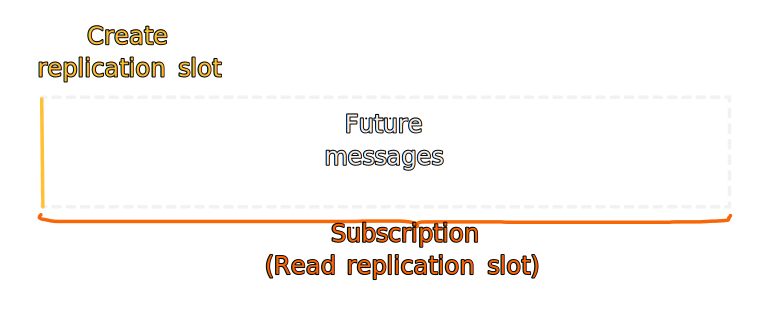
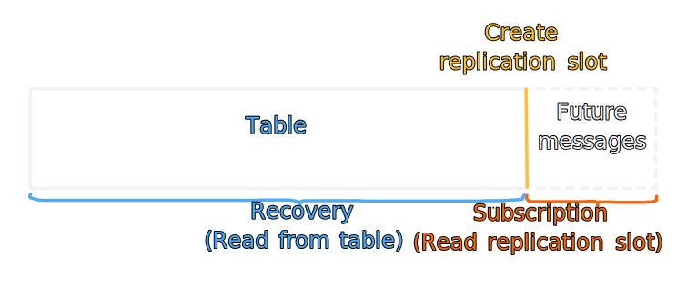
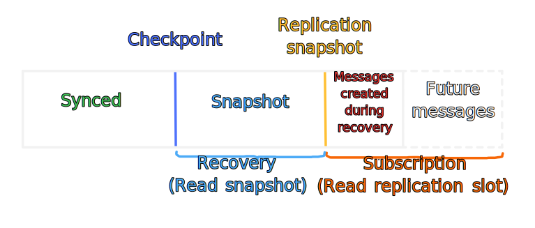
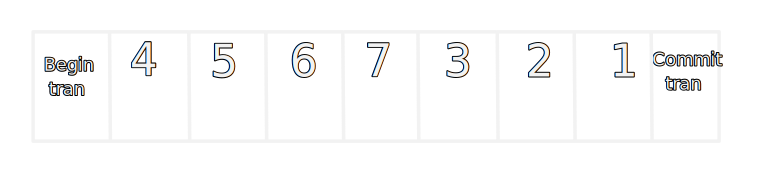
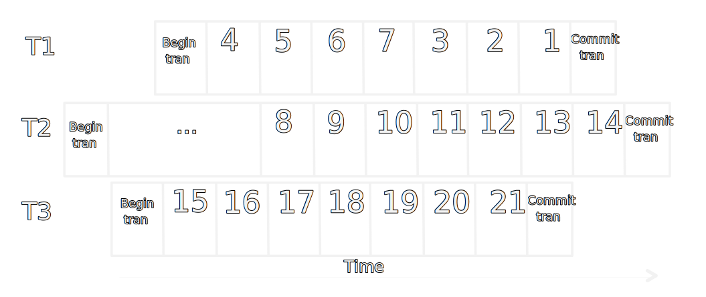

# Change data capture
This module will transfer `OutboxMessages` from postgres to azure service bus. It's highly inspired by Oskar Dudycz following blog posts:  
- [Push-based Outbox Pattern with Postgres Logical Replication](https://event-driven.io/en/push_based_outbox_pattern_with_postgres_logical_replication/)
- [How to get all messages through Postgres logical replication](https://event-driven.io/en/how_to_get_all_messages_through_postgres_logical_replication/)


## Get started
1. Update your local Postgres database with EF migrations.
2. Configure local user secrets with `Infrastructure:DialogDbConnectionString`.
3. Run ChangeDataCapture.

To enable debug logging add the following to the Serilog config in `Program.cs`:

```csharp
.MinimumLevel.Override("Digdir.Domain.Dialogporten.ChangeDataCapture", Serilog.Events.LogEventLevel.Debug)
```

## Testing
Useful SQL commands to use during testing: 
```SQL
-- View CDC checkpoints
SELECT * 
FROM cdc_checkpoint;

-- Delete all CDC checkpoints
DELETE FROM cdc_checkpoint;

-- View publications
SELECT * 
FROM pg_publication;

-- View replication slots
SELECT *
FROM pg_replication_slots;

-- Delete replication slot by name
-- Will force CDC into recovery on next startup
SELECT pg_drop_replication_slot('outboxmessage_cdc_replication_slot');

-- Simulate creation of OutboxMessages
-- Warning, these should not be published onto the service bus because
-- Dialogporten Service don't understand the format.
INSERT INTO public."OutboxMessage"(
	"EventId", "EventType", "EventPayload")
	VALUES 
	(gen_random_uuid(), 'DialogCreated', '{"Number":2}'),
	(gen_random_uuid(), 'DialogCreated', '{"Number":1}'),
	(gen_random_uuid(), 'DialogCreated', '{"Number":3}');
```

## How it works
The CDC module acts as a postgres cluster slave by subscribing to logical WAL changes.

On the postgres side we create a publication and a replication slot. The publication represents what changes should be published to the subscriber. This can range from every change on all tables, to as fine grained as specific actions on certain tables (insert into `OutboxMessage`). The replication slot keeps track of how far a subscriber has consumed the WAL. 



Should the subscriber or postgres shut down, the subscription will resume consuming the WAL from the start of the oldest transaction not acknowledged by the subscriber when both are back up and running. More on this later.

However, if a replication slot exists without a corresponding subscriber the WAL files will accumulate, filling up the storage to the point where postgres won't accept more commands. Effectively killing postgres. Azure Database for PostgreSQL flexible server solves this by dropping unused logical replication slots. Which is a lot better than murdering postgres. But it presents us with a problem. Messages not consumed, and created between dropping and creating the replication slot are not propagated through the new slot. We need a way to recover. 



We can do this by reading directly from the table that we are subscribed to. In our case the `OutboxMessage` table. However, this leaves us with two issues:
1. If we were to fail during recovery we would start to read the entire table again during the next recovery. So messages would be consumed multiple times.
2. `OutboxMessages` created after the replication slot and before recovery will be read two times. First by the recovery, then by the replication slot. If we were to create the replication slot after recovery the opposite would occur. `OutboxMessages` created after recovery and before replication slot will be lost.

We can solve issue 1 by introducing a checkpoint which we will sync every so often, and every time CDC shuts down. 

We can solve issue 2 by taking use of a postgres feature specifically designed to combat this issue. When we create a replication slot we have the option to export a DB snapshot. We can use this snapshot when performing recovery as a fixed point in time where the recovery ends, and the replication slot begins.



This image represents the worst case scenario where there exists no replication slot, CDC may have failed during the last recovery attempt, and messages are created during recovery. I say "may have failed during the last recovery attempt" because this may in fact be the first recovery attempt since the replication slot was dropped. All the synced messages was consumed from the dropped slot, and the checkpoint represents the point in time that the slot should have represented had it been there. In other words - our checkpoint does not only save us on recovery error, it also saves us when the replication slot is dropped. 

### Logical WAL subscription details
Earlier I stated:

> Should the subscriber or postgres shut down, the subscription will resume consuming the WAL from the start of the oldest transaction not acknowledged by the subscriber when both are back up and running. More on this later.

More on this now. The replication slot pointer is traversed when a transactions `CommitMessage` is acknowledged. Say we have a transaction with 4 `OutboxMessage` inserts. We've managed to consume 2 of 4 WAL `InsertMessages` successfully, but CDC shuts down while attempting to consume the third one. Because the replication slot pointer only will traverse the WAL on acknowledged `CommitMessage`, postgres will push WAL messages from the beginning of the same transaction when CDC starts consuming the replication slot again. 


This makes sense when there is an actual postgres slave acting as a subscriber. When the `CommitMessage` is consumed, the slave also commits, otherwise it rolls back and the subscription resumes from the beginning of the transaction. However, for CDC it presents us with two new issues:

1. The first two `InsertMessages` would be consumed two times in the example above. 
2. If we create a recovery checkpoint for every `InsertMessage` we may end up with duplicate, or worse, lost `OutboxMessage` consumptions when transitioning from replication slot subscription to recovery.

Issue 1 is somewhat easy to solve. Instead of the subscription interface returning `IAsyncEnumerable<OutboxMessage>`, it returns `IAsyncEnumerable<IReadOnlyCollection<OutboxMessage>>`. Or in other words - all the `OutboxMessages` for the transaction. Only when the consumer continues the async iteration will the `CommitMessage` be acknowledged. In truth this is only pushing the problem to the subscription consumer. However, returning a collection of `OutboxMessages` makes the intention clearer to the consumer - if you shut down while handling this list, you'll receive the same list when you resume your subscription. Also, many message busses has a concept of batching and transactions. So we can push the problem all the way out of CDC.

Issue 2 is a bit convoluted. Say we have the following transaction where each box represents an `OutboxMessage` and the numbers represents the `CreatedAt` time. 



During recovery `OutboxMessages` are read in ascending `CreatedAt` order. `CreatedAt` is also used when creating a checkpoint. Checkpoints actually consists of this time and an ID (to act as a tie-breaker when multiple `OutboxMessages` has the same timestamp), but we'll represent them with a single number during the example for simplicity. 

Now say we are able to consume 4, 5 and 6 successfully, but CDC shuts down during the processing of 7. If the replication slot is still there on CDC startup there would be no issue. Or at least, that is the issue we've already dealt with during issue 1 further up. However, if the replication slot is not there during CDC startup, it goes into recovery and our checkpoint is used. Out checkpoint points to 6, as it's the last `OutboxMessage` successfully consumed. Recovery will consume 7, but 3, 2 and 1 is lost, as they are lower than our checkpoint 6. **The order in which we consume the WAL is the order in which the rows were inserted according to the SQL used to create them. There is no way to have a user defined order to WAL subscription.** If we were to rearrange the transaction, we could end up consuming multiple times when starting a recovery. 

However, the issue does not stop there. What about concurrent transactions? 



Here we have three concurrent transactions; T1, T2 and T3. The WAL subscription order is determined by the commit order. So in this example T3 would be sent first, then T1, and lastly T2. What if CDC succeeds to consume T3, then goes into recovery? Our checkpoint is now 21, which upon recovery would skip all the `OutboxMessages` from T1 and T2! How do we fix this issue? 

We do this by introducing the configuration `ReplicationCheckpointTimeSkew` which is added to every checkpoint created during replication slot subscription. For example, say CDC is about to create a checkpoint with `ConfirmedAt = 12:00:00`, and the time skew is -2 seconds, the actual checkpoint created would have `ConfirmedAt = 11:59:58`. If CDC now were to go into recovery, and every `OutboxMessage.CreatedAt` in T1 and T2 is after `11:59:58` in our example, we won't lose them. However, we will repeat T3, and every other `OutboxMessage` with `CreatedAt` between `11:59:58` and `12:00:00`. This is a necessary evil we will have to accept, however it only occurs when traversing from replication slot subscription to recovery. During recovery we have full control of the order in which we read `OutboxMessages` from the database. Therefore we have no need to add the time skew to the checkpoints created during this time. So should CDC fail during recovery, it would pick up from exactly where it left of. The lower `ReplicationCheckpointTimeSkew`, the higher the chance to lose `OutboxMessages` on recovery. The higher it is, the more repetition will occur on recovery. Keep in mind that when I say "lost" that the `OutboxMessages` is never truly lost as it is saved in the table, but it will be "lost" to CDC.
